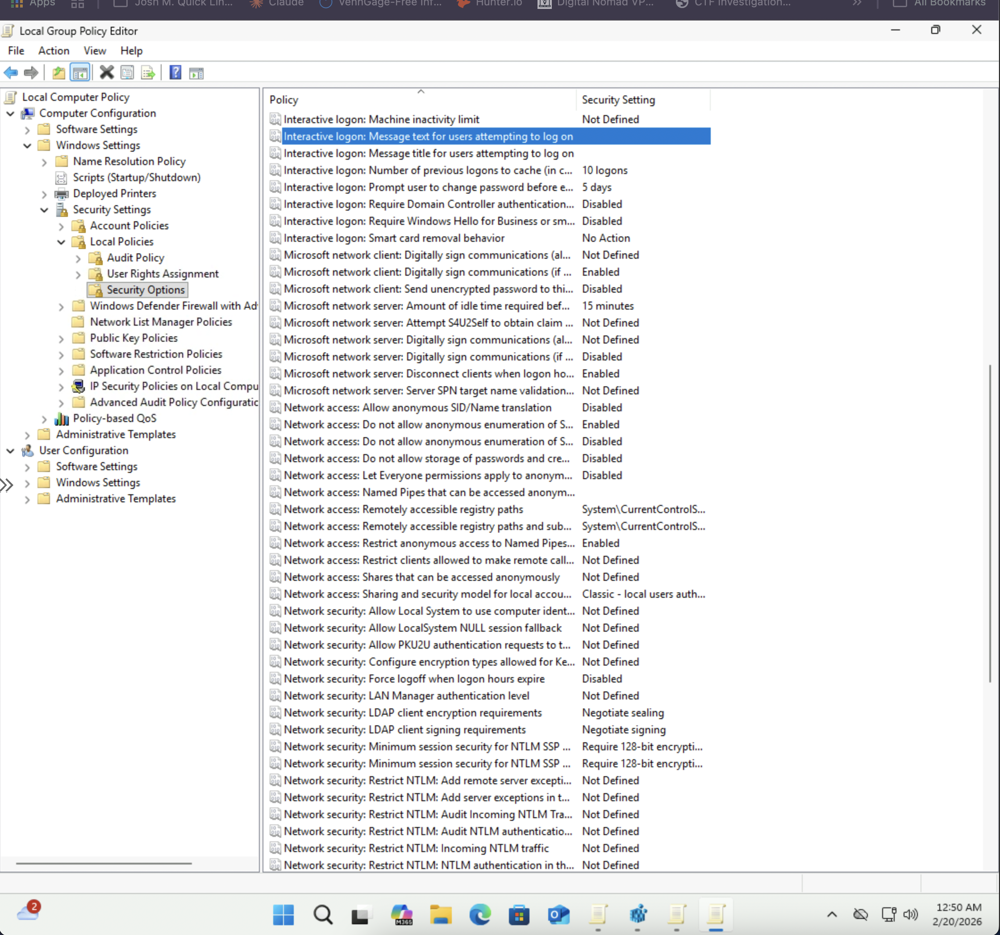
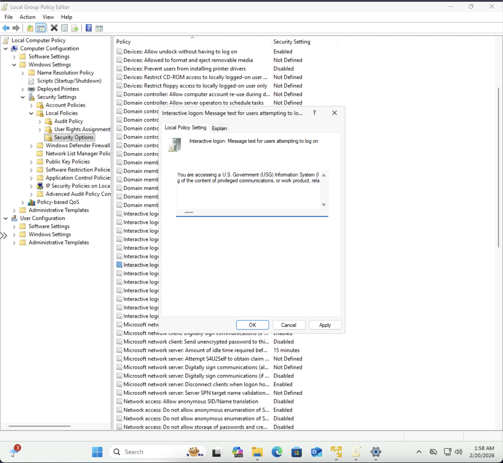
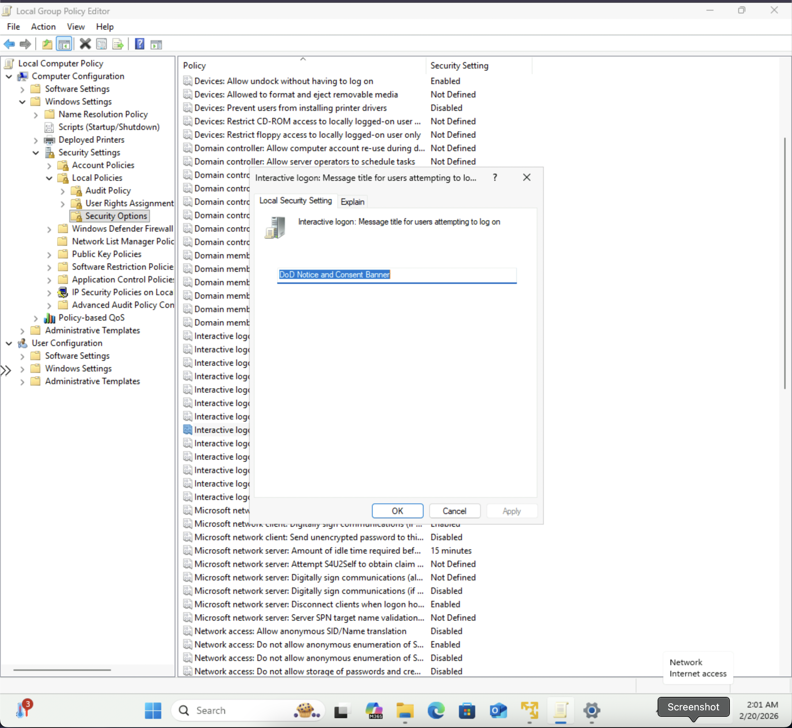
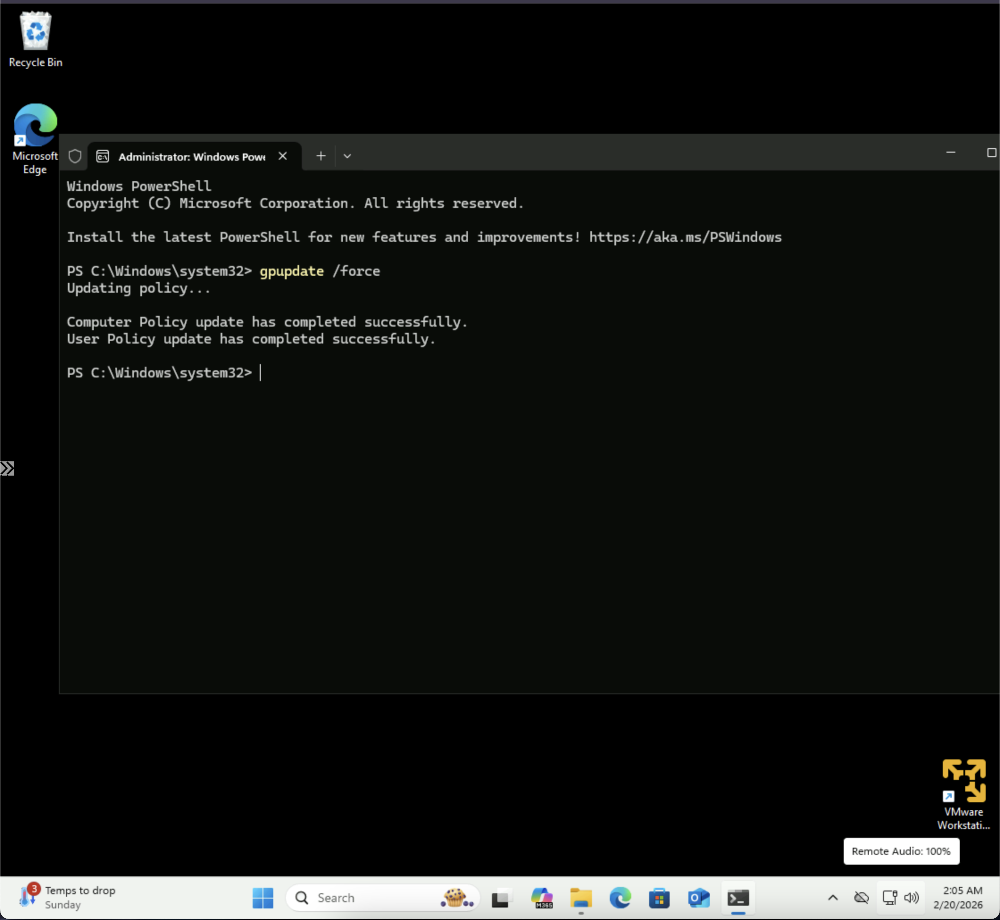
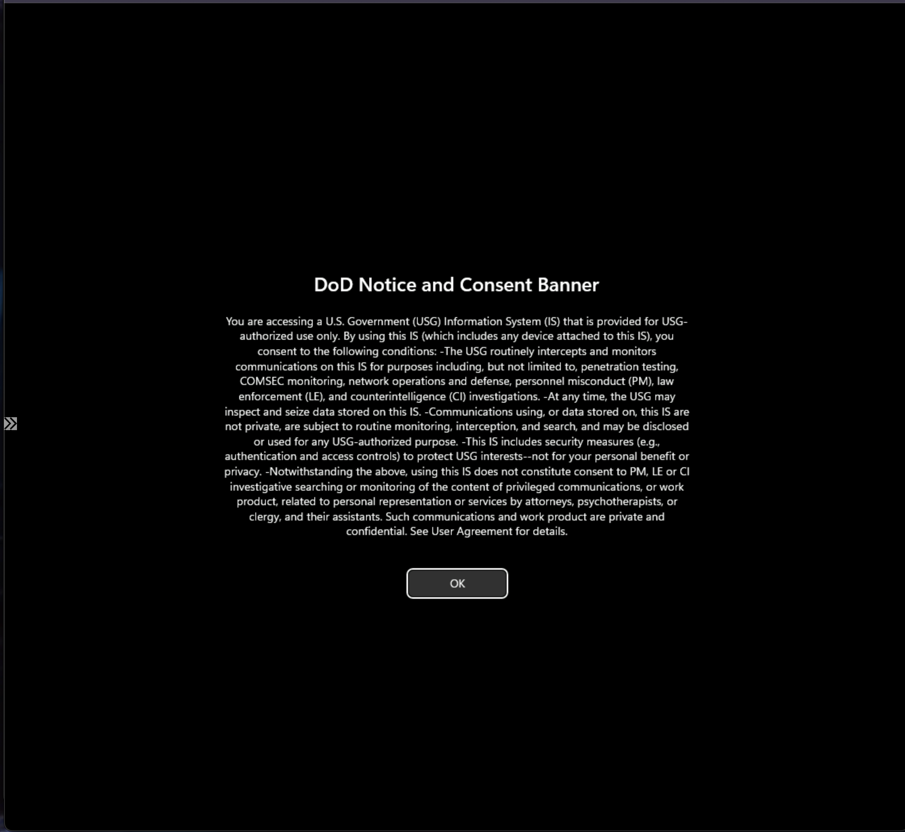
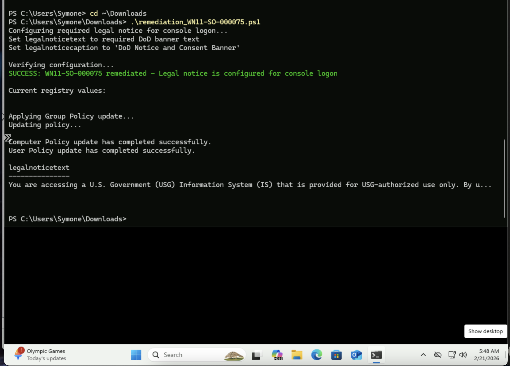

# Windows STIG WN11-SO-000075 Remediation
## Overview
This repository contains remediation for STIG vulnerability WN11-SO-000075: "The required legal notice must be configured to display before console logon."
## Vulnerability Details
- **STIG-ID**: WN11-SO-000075
- **Vuln-ID**: V-253445
- **Severity**: CAT II
- **Description**: Displaying a legal notice before logon ensures users are aware they are accessing a U.S. Government Information System and that their activity is subject to monitoring. Without this banner, unauthorized users may not be properly warned of the legal implications of unauthorized access.
## Remediation Methods
### Automated (PowerShell Script)
Run the `remediation_WN11-SO-000075.ps1` script as Administrator to automatically configure the required DoD legal notice.
**To run:**
```powershell
PS C:\> .\remediation_WN11-SO-000075.ps1
```
### Manual (Group Policy Editor)
1. Open Local Group Policy Editor (`gpedit.msc`)
2. Navigate to: `Computer Configuration` → `Windows Settings` → `Security Settings` → `Local Policies` → `Security Options`
3. Double-click **"Interactive logon: Message text for users attempting to log on"**
4. Paste the required DoD banner text into the text field
5. Click **OK**
6. Double-click **"Interactive logon: Message title for users attempting to log on"**
7. Type `DoD Notice and Consent Banner`
8. Click **OK**
9. Open PowerShell as Administrator and run: `gpupdate /force`
10. Verify both policies show the correct text
## Screenshots
### Before - Security Options Policy Location

### Message Text Configured

### Message Title Configured

### Manual - Group Policy Force Update

### DoD Consent Banner Display on Login Screen

### PowerShell Automated Remediation Success

## Testing Information
- **Tested By**: Symone-Marie Priester
- **Date Tested**: February 20-21, 2026
- **System**: Windows 11 (Version 10.0.26200.7623)
- **PowerShell Version**: 5.1
- **Methods**: Both automated (PowerShell) and manual (Group Policy Editor)
## Repository Structure
```
├── remediation_WN11-SO-000075.ps1                  # PowerShell remediation script
├── WN11-SO-000075_SecurityOptions_Before.png        # Before - policy location
├── WN11-SO-000075_MessageText_Configured.png        # Message text configured
├── WN11-SO-000075_MessageTitle_Configured.png       # Message title configured
├── WN11-SO-000075_gpupdate_force_Manual.png         # Manual - Group Policy force update
├── DoD_Consent_Banner_Display.png                   # DoD banner displayed on login screen
├── WN11-SO-000075_Programmatic_Remediation.png      # PowerShell remediation success
└── README.md                                         # This file
```
## Author
**Symone-Marie Priester**
- LinkedIn: [linkedin.com/in/symone-mariepriester](https://linkedin.com/in/symone-mariepriester)
- GitHub: [github.com/Symone-Marie](https://github.com/Symone-Marie)
